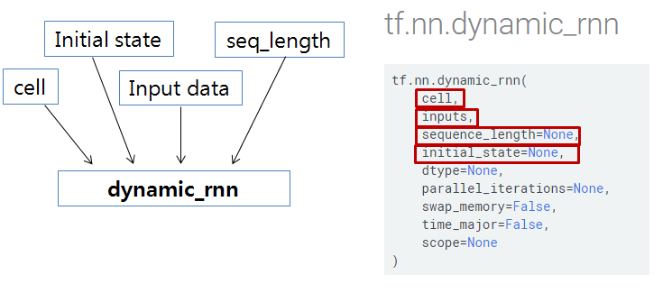

# Tensorflow RNN Basic of Basic
<p align="center">  </p>


* 위 그림은 tensorflow에서 기본적인 RNN모델을 만드는데 필요한 API들의 관계를 그린 것이다.

* Example은 (단어 3개 + SOS + EOS)로 전체 5개의 vocabulary를 가지고, embedding 처리 후, BasicRNNCell를 거친다.
* BasicRNNCell을 거친 후에 Fully-Connected Layer(OutputProjectionWrapper)를 한번 더 거치면 최종 output이 만들어진다.
* 정리하면, 5개의 단어를 가지고, [minimal character-level RNN language model](http://karpathy.github.io/2015/05/21/rnn-effectiveness/)을 만들어 본다.
* 위 그림에서 처럼, {cell, inital_state, input_data, seq_length} 이렇게 4개의 object를 만들어서 dynamic_rnn에 넘겨주면 된다.
* 먼저 Example Code 전체를 보고, 부분 부분 살펴보자.

```python
# -*- coding: utf-8 -*-
import numpy as np
import tensorflow as tf
tf.reset_default_graph()

def dynamic_rnn_test():

    vocab_size = 5
    SOS_token = 0
    EOS_token = 4
    
    x_data = np.array([[SOS_token, 3, 1, 2, 3, 2],[SOS_token, 3, 1, 2, 3, 1],[SOS_token, 1, 3, 2, 2, 1]], dtype=np.int32)
    y_data = np.array([[1,2,0,3,2,EOS_token],[3,2,3,3,1,EOS_token],[3,1,1,2,0,EOS_token]],dtype=np.int32)
    Y = tf.convert_to_tensor(y_data)
    print("data shape: ", x_data.shape)
    sess = tf.InteractiveSession()
    
    output_dim = vocab_size
    batch_size = len(x_data)
    hidden_dim =6
    num_layers = 2
    seq_length = x_data.shape[1]
    embedding_dim = 8

    init = np.arange(vocab_size*embedding_dim).reshape(vocab_size,-1)
    
    with tf.variable_scope('test') as scope:
        # Make rnn

        cell = tf.contrib.rnn.BasicRNNCell(num_units=hidden_dim)
        cell = tf.contrib.rnn.OutputProjectionWrapper(cell,output_dim)
    
        embedding = tf.get_variable("embedding", initializer=init.astype(np.float32),dtype = tf.float32)
        inputs = tf.nn.embedding_lookup(embedding, x_data) # batch_size  x seq_length x embedding_dim
    
        initial_state = cell.zero_state(batch_size, tf.float32) #(batch_size x hidden_dim) 
        outputs, last_state = tf.nn.dynamic_rnn(cell,inputs,initial_state=initial_state)    

        weights = tf.ones(shape=[batch_size,seq_length])
        loss =   tf.contrib.seq2seq.sequence_loss(logits=outputs, targets=Y, weights=weights)
    
        sess.run(tf.global_variables_initializer())
        print("initial_state: ", sess.run(initial_state))
        print("\n\noutputs: ",outputs)
        o = sess.run(outputs)  #batch_size, seq_length, outputs
        o2 = sess.run(tf.argmax(outputs,axis=-1))
        print("\n",o,o2) #batch_size, seq_length, outputs
    
        print("\n\nlast_state: ",last_state)
        print(sess.run(last_state)) # batch_size, hidden_dim
      
        p = sess.run(tf.nn.softmax(outputs)).reshape(-1,output_dim)
        print("loss: {:20.6f}".format(sess.run(loss)))
        print("manual cal. loss: {:0.6f} ".format(np.average(-np.log(p[np.arange(y_data.size),y_data.flatten()]))) )

if __name__ == '__main__':
    dynamic_rnn_test()
    print('Done')
```

#[Code 설명]
```python
    vocab_size = 5
    SOS_token = 0
    EOS_token = 4
    
    x_data = np.array([[SOS_token, 3, 1, 2, 3, 2],[SOS_token, 3, 1, 2, 3, 1],[SOS_token, 1, 3, 2, 2, 1]], dtype=np.int32)
    y_data = np.array([[1,2,0,3,2,EOS_token],[3,2,3,3,1,EOS_token],[3,1,1,2,0,EOS_token]],dtype=np.int32)
    Y = tf.convert_to_tensor(y_data)
'''

* 0(SOS),1,2,3,EOS(4) --> 모두 5개의 단어에 대하여, batch_size=3인 sample data를 만들었다.

