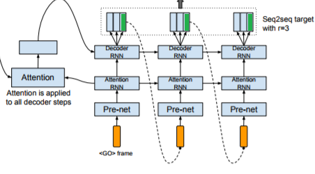

# Tensorflow에서 BasicDecoder에 넘겨 줄 수 있는 사용자 정의 Helper Calss를 만들어 보자.
User Defined Helper는 tensorflow.contrib.seq2seq.Helper를 상속받아 구현할 수 있다.

### [목차]
* [왜 User Defined Helper가 필요한가](#왜-User-Defined-Helper가-필요한가)
* [User Defined Helper 만들기](#User-Defined-Helper-만들기)
* [TacotronTestHelper 만들기](#TacotronTestHelper-만들기)

### [왜 User Defined Helper가 필요한가]
* 기본적으로 TrainingHelper, GreedyEmbeddingHelper, SampleEmbeddingHelper 등을 주로 사용한다.
* 모델에 따라서는 이런 표준적인 Helper로 처리할 수 없는 경우가 있다. 
* 예를 들어, [Tacotron](https://arxiv.org/abs/1703.10135) 모델의 Decoder구조는 r(reduction factor, 아래 그림에서는 3)개의 output을 만들어 내고, 그 중 마지막 것을 다음 step의 input으로 넘겨주는 방식으로 설계되어 있다(inference 단계). 이런 모델을 구현하기 위해서는 User Defined Helper가 필요하다.
<p align="center">  </p>

* train 단계, inference 단계 각각에 맞는 Helper가 필요하다.

### [User Defined Helper 만들기]
* TrainingHelper와 동일한 User Defined Helper를 하나 만들어보다.
* tensorflow.contrib.seq2seq.Helper를 상속받아 구현해야 한다.

```python
class MyRnnHelper(Helper):
    # property(batch_size,sample_ids_dtype,sample_ids_shape)이 정의되어야 하고, initialize,sample,next_inputs이 정의되어야 한다.
    def __init__(self,embedding,batch_size,output_dim,sequence_length):
        self._embedding = embedding
        self._batch_size = batch_size
        self._output_dim = output_dim
        self._sequence_length = sequence_length

    @property
    def batch_size(self):
        return self._batch_size

    @property
    def sample_ids_dtype(self):
        return tf.int32

    @property
    def sample_ids_shape(self):
        return tf.TensorShape([])   # sample_ids의 shape이 (batch_size,) 이므로, batch_size를 제외하면, "[]"이 된다.

    def next_inputs(self, time, outputs, state, sample_ids, name=None):   # time+1을 위한 input을 만든다., outputs,state,sample_ids는 time step에서의 결과이다.
        # 넘어오는 sample_ids는 sample 함수에어 계산된어 넘어온 값이다.   <----- 이런 계산은 BasicDecoder의 'step' 함수에서 이루어 진다.
        # next input을 계산하기 위해서 sample_ids를 이용하거나, outpus를 이용하거나 선택하면 된다.
        
        next_time = time + 1
        finished = (next_time >= self._sequence_length)
        next_inputs = tf.nn.embedding_lookup(self._embedding,sample_ids)
        return (finished, next_inputs, state)  #finished==True이면 next_inputs,state는 의미가 없다.

    def initialize(self, name=None):
        # 시작하는 input을 정의한다.
        # return (finished, first_inputs). finished는 시작이니까, 무조건 False
        # first_inputs는 예를 위해서, SOS_token으로 만들어 보았다.
        return (tf.tile([False], [self._batch_size]), tf.nn.embedding_lookup(self._embedding,tf.tile([SOS_token], [self._batch_size])))  

    def sample(self, time, outputs, state, name=None):
        return tf.argmax(outputs, axis=-1,output_type=tf.int32)
```

* 필수 property 3개(batch_size, sample_ids_dtype, sample_ids_shape)를 구현해야하고,
* member function 3개(initialize,sample,next_inputs)도 구현하면 된다.
* 필수 property들과 member function을 구현하는데 필요한 추가적인 정보가 필요하다면 __init__ 에서 받아오도록 하면 된다.
* def initialize(self, name=None): RNN 모형에서 첫 input data를 만들어 주는 역할을 한다.
*  def sample(self, time, outputs, state, name=None): time에서 만들어진 output, state을 조합해서 sample을 만든다. 예를 들어, TrainingHelper에서는 argmax를 취해서 sample을 만들고, SampleEmbeddingHelper에서는 단순 argmax 대신 distribution을 이용해서 random sampling으로 sample을 만든다. 
* def next_inputs(self, time, outputs, state,sample_ids, name=None): time step에서 만들어진 output, state와 sample함수에서 만들어진 sample_ids를 이용하여 time+1(다음 step)을 위한 입력 data를 만들어주면 된다.
* next_inputs 함수 내에서 batch data마다 길이가 다르기 때문에, finished를 정확히 계산하려면 sequence_length를 __init__ 에서 받아와야 한다.


### [TacotronTestHelper 만들기]
* Tacotron 모델에서 inference 단계에서 사용할 Helper를 만들어 보자. 

```python
class TacoTestHelper(Helper):
    def __init__(self, batch_size, output_dim, r):
        with tf.name_scope('TacoTestHelper'):
            self._batch_size = batch_size
            self._output_dim = output_dim
            self._end_token = tf.tile([0.0], [output_dim * r])  # [0.0,0.0,...]

    @property
    def batch_size(self):
        return self._batch_size
    
    @property
    def sample_ids_dtype(self):
        return tf.int32

    @property
    def sample_ids_shape(self):
        return tf.TensorShape([])
    
    def initialize(self, name=None):
        return (tf.tile([False], [self._batch_size]), tf.tile([[0.0]], [self._batch_size, self._output_dim]))

    def sample(self, time, outputs, state, name=None):
        # sample함수가 특별히 할 역할이 없기 때문에 그냥 garbage를 return한다.
        return tf.tile([0], [self._batch_size])  # Return all 0; we ignore them

    def next_inputs(self, time, outputs, state, sample_ids, name=None):
        '''Stop on EOS. Otherwise, pass the last output as the next input and pass through state.'''
        with tf.name_scope('TacoTestHelper'):
            finished = tf.reduce_all(tf.equal(outputs, self._end_token), axis=1)
            # Feed last output frame as next input. outputs is [N, output_dim * r]
            next_inputs = outputs[:, -self._output_dim:]  #outputs: (batch_size, output_dim*r)에서 마지막 output_dim개만 return
            return (finished, next_inputs, state)
```

* 함수 next_inputs에서 next_inputs를 계산하는 방식에만 주목하면 된다. output_dim*r 중에서 마지막 output_dim개만 return했다.


---
## Reference
- https://github.com/keithito/tacotron
