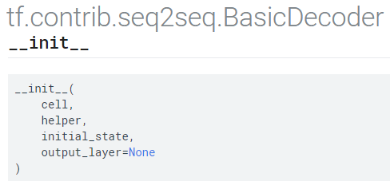

# 기본적으로 사용하는 BasicDecoder를 사용하지만, User Definced Help나 RNNWrapper를 사용하기 위해서는 Cumtomization이 필요하다.

### [목차]
* [User Defined Decoder는 언제 필요한가](#User-Defined-Decoder는-언제-필요한가)
* [BasicDecoder Cumtomization](#BasicDecoder-Cumtomization)

---


### [User Defined Decoder는 언제 필요한가]
* BasicDecoder의 __init__ 함수는 다음과 같은 proto type을 가진다.
<p align="center">  </p>

* 다음은 BasicDecoder의 member function인 step 함수이다.
```python
def step(self, time, inputs, state, name=None):
  """Perform a decoding step.
  Args:
    time: scalar `int32` tensor.
    inputs: A (structure of) input tensors.
    state: A (structure of) state tensors and TensorArrays.
    name: Name scope for any created operations.
  Returns:
    `(outputs, next_state, next_inputs, finished)`.
  """
  with ops.name_scope(name, "BasicDecoderStep", (time, inputs, state)):
    cell_outputs, cell_state = self._cell(inputs, state)
    if self._output_layer is not None:
      cell_outputs = self._output_layer(cell_outputs)
    sample_ids = self._helper.sample(
        time=time, outputs=cell_outputs, state=cell_state)
    (finished, next_inputs, next_state) = self._helper.next_inputs(
        time=time,
        outputs=cell_outputs,
        state=cell_state,
        sample_ids=sample_ids)
  outputs = BasicDecoderOutput(cell_outputs, sample_ids)
  return (outputs, next_state, next_inputs, finished)
```

* __init__에서 넘겨받은 cell, helper를 step함수에서 처리하고 있는 것을 볼 수 있다.
* __init__에 넘겨지는 cell이나 helper를 표준적인 형식에서 벗어나게 customization했다면, BasicDecoder를 사용할 수 없다.
* 좀 더 구체적으로 살펴보자.
* Helper의 next_inputs함수의 proto type은 다음과 같다.
```python
def next_inputs(self, time, outputs, state, sample_ids, name=None):
```
* (time, outputs, state, sample_ids,name)으로 이루어진 argument에 다음과 같이 추가적인 argument가 더해진다고 해보자.
```python
def next_inputs(self, time, outputs, state, new_arg, sample_ids, name=None):
```
* 이런 경우에는, BasicDecoder를 customization해야 한다.

* 또 다른 예로, cell의 __call__함수의 argument나 return의 형식이 변경되는 경우에도 BasicDecoder를 사용할 수 없다.

---


### [BasicDecoder Cumtomization]
* Tensorflow의 BasicDecoder [구현](https://github.com/tensorflow/tensorflow/blob/r1.12/tensorflow/contrib/seq2seq/python/ops/basic_decoder.py)을 살펴보면 생각보다 간단함을 알 수 있다.
* self.cell(...)이나 self._helper.next_input(...)을 상황에 맞게 변경하기만 하면 된다.
