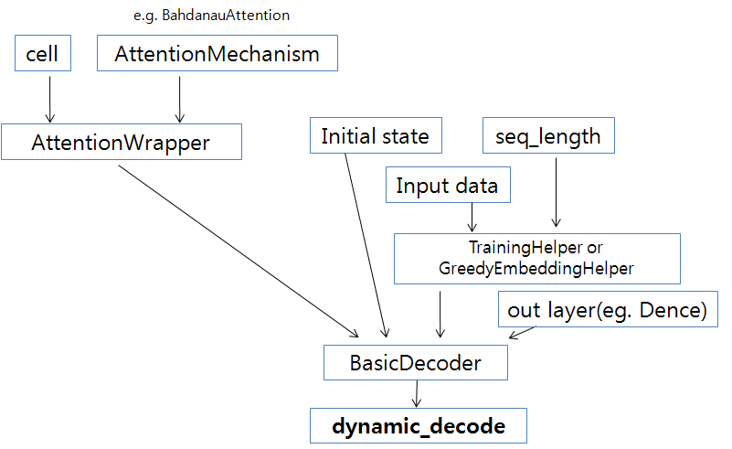
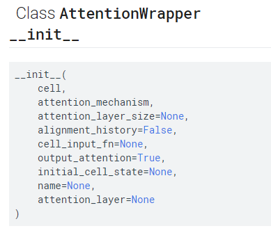

# Tensorflow에서 Attention Model이 RNN API와 어떻게 연계되어 동작하는지 살펴보자.

## Attention Model
* 대표적인 Attention Model은 `Bahdanau Attention`, `Luong Attention` 등이 있다.
* 이런 Attention Model에 Monotonic한 성질을 더하여 Bahdanau Monotonic Attention, Luong Monotonic Attention이 만들어 질 수도 있다.
* Tensorflow에서는 Attention Model이 `Attention Mechanism` 이라는 개념으로 다루어진다.



* 위 그림은 Tensorflow Attention API가 이전 tutorial에서 다룬 Tensorflow의 RNN API(BasicDecoder, dynamic_decode 등)와 어떻게 연결되는지 보여주고 있다.
* 이전에 tutorial에서 다룬 BasicRNNCell, BasicLSTMCell, GRUCell 등은 class RNNCell을 상속받아 구현된 class들이다.
* Attention Model을 적용하기 위해서는, 이런 cell들을 대신해서 AttentionWrapper라는 class가 필요한데, 이 AttentionWrapper 또한 RNNCell class를 상속하여 구현된 class이다.



* AttentionWrapper의 __init__함수의 주요 argument는 {cell, attention_mechanism, attention_layer_size, output_attention, initial_cell_state}이다.
* 이 주요 argument를 하나씩 살펴보자.

### cell
* cell에는 지금까지 다룬, BasicRNNCell, BasicLSTMCell, GRUCell 등을 넣어 주면된다.


### attention_mechanism
* attention_mechanism은 `AttentionMechanism` object를 넣어 주어야 한다.
* `AttentionMechanism`에는 `tf.contrib.seq2seq.BahdanauAttention`, `tf.contrib.seq2seq.LuongAttention`, `tf.contrib.seq2seq.BahdanauMonotonicAttention` 등이 있다.


## [Full Code]
```python
# coding: utf-8
import tensorflow as tf
import numpy as np

tf.reset_default_graph()
def attention_test():
    # BasicRNNCell을 single로 쌓아 attention 적용
    vocab_size = 5
    SOS_token = 0
    EOS_token = 4
    
    x_data = np.array([[SOS_token, 3, 1, 2, 3, 2],[SOS_token, 3, 1, 2, 3, 1],[SOS_token, 1, 3, 2, 2, 1]], dtype=np.int32)
    y_data = np.array([[1,2,0,3,2,EOS_token],[3,2,3,3,1,EOS_token],[3,1,1,2,0,EOS_token]],dtype=np.int32)
    Y = tf.convert_to_tensor(y_data)
    print("data shape: ", x_data.shape)
    sess = tf.InteractiveSession()
    
    output_dim = vocab_size
    batch_size = len(x_data)
    hidden_dim =6
    seq_length = x_data.shape[1]
    embedding_dim = 8

    init = np.arange(vocab_size*embedding_dim).reshape(vocab_size,-1)
    
    alignment_history_flag = True   # True이면 initial_state나 last state를 sess.run 하면 안됨. alignment_history가 function이기 때문에...
    with tf.variable_scope('test',reuse=tf.AUTO_REUSE) as scope:
        # Make rnn cell
        cell = tf.contrib.rnn.BasicRNNCell(num_units=hidden_dim)
        
        
        embedding = tf.get_variable("embedding", initializer=init.astype(np.float32),dtype = tf.float32)
        inputs = tf.nn.embedding_lookup(embedding, x_data) # batch_size  x seq_length x embedding_dim
    
        #encoder_outputs은 Encoder의 output이다. 보통 Memory라 불린다. 여기서는 toy model이기 때문에 ranodm값을 생성하여 넣어 준다.
        encoder_outputs = tf.convert_to_tensor(np.random.normal(0,1,[batch_size,20,30]).astype(np.float32)) # 20: encoder sequence length, 30: encoder hidden dim
        
        input_lengths = [5,10,20]  # encoder에 padding 같은 것이 있을 경우, attention을 주지 않기 위해
        
        # attention mechanism  # num_units = Na = 11
        attention_mechanism = tf.contrib.seq2seq.BahdanauAttention(num_units=11, memory=encoder_outputs,memory_sequence_length=input_lengths,normalize=False)

        
        attention_initial_state = cell.zero_state(batch_size, tf.float32)
        cell = tf.contrib.seq2seq.AttentionWrapper(cell, attention_mechanism, attention_layer_size=13,initial_cell_state=attention_initial_state,
                                                   alignment_history=alignment_history_flag,output_attention=True)
        cell = tf.contrib.rnn.OutputProjectionWrapper(cell,output_dim)
        
        # 여기서 zero_state를 부르면, 위의 attentionwrapper에서 넘겨준 attention_initial_state를 가져온다. 즉, AttentionWrapperState.cell_state에는 넣어준 값이 들어있다.
        initial_state = cell.zero_state(batch_size, tf.float32) # AttentionWrapperState
 
        helper = tf.contrib.seq2seq.TrainingHelper(inputs, np.array([seq_length]*batch_size))

        decoder = tf.contrib.seq2seq.BasicDecoder(cell=cell,helper=helper,initial_state=initial_state)    

        outputs, last_state, last_sequence_lengths = tf.contrib.seq2seq.dynamic_decode(decoder=decoder,output_time_major=False,impute_finished=True)
     
        weights = tf.ones(shape=[batch_size,seq_length])
        loss =   tf.contrib.seq2seq.sequence_loss(logits=outputs.rnn_output, targets=Y, weights=weights)
     
        opt = tf.train.AdamOptimizer(0.01).minimize(loss)
        
        sess.run(tf.global_variables_initializer())
        for i in range(100):
            loss_,_ =sess.run([loss,opt])
            print("{} loss: = {}".format(i,loss_))
        
        if alignment_history_flag ==False:
            print("initial_state: ", sess.run(initial_state))
        print("\n\noutputs: ",outputs)
        o = sess.run(outputs.rnn_output)  #batch_size, seq_length, outputs
        o2 = sess.run(tf.argmax(outputs.rnn_output,axis=-1))
        print("\n",o,o2) #batch_size, seq_length, outputs
     
        print("\n\nlast_state: ",last_state)
        if alignment_history_flag == False:
            print(sess.run(last_state)) # batch_size, hidden_dim
        else:
            print("alignment_history: ", last_state.alignment_history.stack())
            alignment_history_ = sess.run(last_state.alignment_history.stack())
            print(alignment_history_)
            print("alignment_history sum: ",np.sum(alignment_history_,axis=-1))
            
            print("cell_state: ", sess.run(last_state.cell_state))
            print("attention: ", sess.run(last_state.attention))
            print("time: ", sess.run(last_state.time))
            
            alignments_ = sess.run(last_state.alignments)
            print("alignments: ", alignments_)
            print('alignments sum: ', np.sum(alignments_,axis=1))   # alignments의 합이 1인지 확인
            print("attention_state: ", sess.run(last_state.attention_state))

        print("\n\nlast_sequence_lengths: ",last_sequence_lengths)
        print(sess.run(last_sequence_lengths)) #  [seq_length]*batch_size    
     
        p = sess.run(tf.nn.softmax(outputs.rnn_output)).reshape(-1,output_dim)
        print("loss: {:20.6f}".format(sess.run(loss)))
        print("manual cal. loss: {:0.6f} ".format(np.average(-np.log(p[np.arange(y_data.size),y_data.flatten()]))) )   

if __name__ == '__main__':
    attention_test()
```
