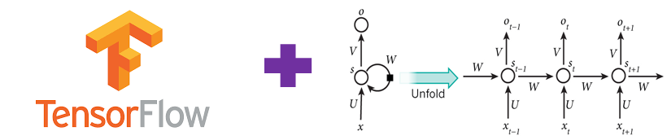

## Tesorflow RNN-tutorial

  

`Tesorflow RNN-tutorial` is a tutorial for RNN model developers using Tensorflow.

### -1. [Tensorflow RNN 기초](https://github.com/hccho2/RNN-Tutorial/tree/master/0.%20Basic)

#### 0. [Basic RNN Model](https://github.com/hccho2/RNN-Tutorial/tree/master/0.%20Basic)
Tensorflow의 다음과 같은 API를 사용하여 기본적인 RNN 모델의 작동 원리를 알 수 있다.
- dynamic_decode를 사용하여 Tensorflow RNN모델 사용법에 관해 알아본다.
- BasicRNNCell, BasicLSTMCell, GRUCell
- TrainingHelper, GreedyEmbeddingHelper
- BasicDecoder
- dynamic_decode

#### 1. [User Defined RNNWrapper](https://github.com/hccho2/RNN-Tutorial/tree/master/1.%20RNNWrapper) 
사용자 정의 RNN Wrapper를 만드는 방법에 대하여 알아본다. 
- RNNCell을 상속받아 사용자 정의 RNN Wrapper class를 정의한다.
- 여기서 만드는 RNN Wrapper는 BasicRNNCell을 대체할 수 있다.

#### 2. [User Defined Helper](https://github.com/hccho2/Tensorflow-RNN-Tutorial/tree/master/2.%20User%20Defined%20Helper)
주로 사용하는 TrainingHelper, GreedyEmbeddingHelper, SampleEmbeddingHelper를 대신할 수 있는 사용자 정의 Helper를 만들어 보자.
- Tacotron과 같은 모델에서는 RNN decoder를 구현하려면 사용자 정의 Helper가 반드시 필요하다.

---
-------- 여기서 부터는 update 예정 -----------

#### 3. [User Defined Decoder]
BasicDecoder를 대체할 수 있는 사용자 정의 Decoder를 만들어 보자.

#### 4. [Attention with Tensorflow]
- Bahdanau Attention, Luong Attention이 Tensorflow내에서 어떻게 작동하는지에 대하여 알아 보자.

