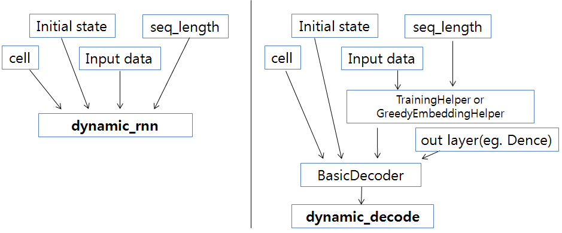

# Tensorflow에서 tf.contrib.seq2seq.dynamic_decode를 어떻게 사용해야 하는지 설명.
아래 그림은 tf.nn.dynamic_rnn과 tf.contrib.seq2seq.dynamic_decode의 입력 구조를 비교한 그림이다.


 * Tensorflow에서는 seq2seq(encoder-decoder) 모델을 다룰 수 있는 dynamic_rnn, dynamic_decode를 제공하고 있다.
 * dynamic_rnn은 좀 더 단순한 구조로 되어 있는데, 여기서는 dynamic_decode를 이용해서 설명한다.
 * cell은 BasicRNNCell,BasicLSTMCell,GRUCell이 올 수 있고, 이런 것들은 쌓은 MultiRNNCell도 올 수 있다.
 * initial_state는 hidden state의 초기값으로 zero_state, encoder의 마지막  hidden state, captioning model에서 image의 feature등이 올 수 있다.
 * TrainingHelper는 training 단계에서 사용하고, GreedyEmbeddingHelper는 inference 단계에서 사용하면 된다.
 * GreedyEmbeddingHelper는 inference에 사용하는 hleper로 전단계의 output의 argmax에 해당하는 결과를 다음 단계의 input으로 전달된다.
 
### [code 설명]
 * 전체 코드는 RNN-TF-dynamic-decode.py에 있고, 이 페이지의 [아래](#main-code)에서도 확인할 수 있다.
 * 이제 코드의 시작부터 잘라서 설명해 보자.
```rust
vocab_size = 5
SOS_token = 0
EOS_token = 4

x_data = np.array([[SOS_token, 2, 1, 2, 3, 2],[SOS_token, 3, 1, 2, 3, 1],[SOS_token, 1, 3, 2, 2, 1]], dtype=np.int32)
y_data = np.array([[1,2,0,3,2,EOS_token],[3,2,3,3,1,EOS_token],[3,1,1,2,0,EOS_token]],dtype=np.int32)
```
 * 간단한 data로 설명하기 위해, 단어 개수 vocab_size = 5로 설정. 제시된 x_data, y_data를 보면 알 수 있듯이, x_data는 SOS_token으로 시작하고, y_data는 EOS_token으로 끝난다.
 * seq_length는 6이다. batch data들의 길이가 같지 않은 경우가 대부분인데, 이를 경우에는 Null을 도입하여 최대 길이(max_sequence)를 정하고, 뒷부분을 Null로 채워서 길이를 맞춘다.
 * 실전 data에서는 data file을 읽어, 단어를 숫자로 mapping하고 Null로 padding하는 등의 preprocessing에 많은 시간이 소요될 수 있다.
 * Tensorflow의 data 입력 op인 placeholder를 사용해야하는데, 여기서는 간단함을 위해 사용하지 않는다. 


```rust
output_dim = vocab_size
batch_size = len(x_data)
hidden_dim = 6
num_layers = 2
seq_length = x_data.shape[1]
embedding_dim = 8

state_tuple_mode = True
init_state_flag = 0
train_mode = True
```
* output_dim은 RNN cell의 output에 연결되는 FC layer의 출력 dimension이다. 보통의 경우 단어 개수와 동일한 dimension이다. 그래서 output_dim = vocab_size
* batch_size는 추가 설명 불필요.
* hidden_dim은 말 그대로 RNN cell의 hidden layer size.
* num_layer는 Multi RNN모델에서 RNN layer를 몇 층으로 쌓을지 결정하는 값. 예를 들어, num_layer만큼 LSTM cell을 쌓는다.
* embedding_dim은 각 단어를 몇 차원 vector로 mapping할지 결정하는 변수.
* 나머지 3개 변수(state_tuple_mode,init_state_flag,train_mode)는 코드 상의 옵션을 설정하는 변수로 중요한 것은 아님. 차차 설명함.


---
### main code

```rust
# -*- coding: utf-8 -*-

import numpy as np
import tensorflow as tf


from tensorflow.python.layers.core import Dense
tf.reset_default_graph()

vocab_size = 5
SOS_token = 0
EOS_token = 4

x_data = np.array([[SOS_token, 2, 1, 2, 3, 2],[SOS_token, 3, 1, 2, 3, 1],[SOS_token, 1, 3, 2, 2, 1]], dtype=np.int32)
y_data = np.array([[1,2,0,3,2,EOS_token],[3,2,3,3,1,EOS_token],[3,1,1,2,0,EOS_token]],dtype=np.int32)
print("data shape: ", x_data.shape)


output_dim = vocab_size
batch_size = len(x_data)
hidden_dim = 6
num_layers = 2
seq_length = x_data.shape[1]
embedding_dim = 8

state_tuple_mode = True
init_state_flag = 0
train_mode = True


#init = np.arange(vocab_size*embedding_dim).reshape(vocab_size,-1).astype(np.float32) # 이경우는 아래의 embedding의 get_variable에서 shape을 지정하면 안된다.
init = tf.contrib.layers.xavier_initializer()


with tf.variable_scope('test',reuse=tf.AUTO_REUSE) as scope:
    # Make rnn
    cells = []
    for _ in range(num_layers):
        #cell = tf.contrib.rnn.BasicRNNCell(num_units=hidden_dim)
        cell = tf.contrib.rnn.BasicLSTMCell(num_units=hidden_dim,state_is_tuple=state_tuple_mode)
        cells.append(cell)
    cell = tf.contrib.rnn.MultiRNNCell(cells)    
    #cell = tf.contrib.rnn.BasicRNNCell(num_units=hidden_dim)

    embedding = tf.get_variable("embedding",shape=[vocab_size,embedding_dim], initializer=init,dtype = tf.float32)
    inputs = tf.nn.embedding_lookup(embedding, x_data) # batch_size  x seq_length x embedding_dim

    

    if init_state_flag==0:
         initial_state = cell.zero_state(batch_size, tf.float32) #(batch_size x hidden_dim) x layer 개수 
    else:
        if state_tuple_mode:
            h0 = tf.random_normal([batch_size,hidden_dim]) #h0 = tf.cast(np.random.randn(batch_size,hidden_dim),tf.float32)
            initial_state=(tf.contrib.rnn.LSTMStateTuple(tf.zeros_like(h0), h0),) + (tf.contrib.rnn.LSTMStateTuple(tf.zeros_like(h0), tf.zeros_like(h0)),)*(num_layers-1)
            
        else:
            h0 = tf.random_normal([batch_size,hidden_dim]) #h0 = tf.cast(np.random.randn(batch_size,hidden_dim),tf.float32)
            initial_state = (tf.concat((tf.zeros_like(h0),h0), axis=1),) + (tf.concat((tf.zeros_like(h0),tf.zeros_like(h0)), axis=1),) * (num_layers-1)
    if train_mode:
        helper = tf.contrib.seq2seq.TrainingHelper(inputs, np.array([seq_length]*batch_size))
    else:
        helper = tf.contrib.seq2seq.GreedyEmbeddingHelper(embedding, start_tokens=tf.tile([SOS_token], [batch_size]), end_token=EOS_token)

    output_layer = Dense(output_dim, name='output_projection')
    decoder = tf.contrib.seq2seq.BasicDecoder(cell=cell,helper=helper,initial_state=initial_state,output_layer=output_layer)    
    # maximum_iterations를 설정하지 않으면, inference에서 EOS토큰을 만나지 못하면 무한 루프에 빠진다
    outputs, last_state, last_sequence_lengths = tf.contrib.seq2seq.dynamic_decode(decoder=decoder,output_time_major=False,impute_finished=True,maximum_iterations=10)

    
    Y = tf.convert_to_tensor(y_data)
    weights = tf.ones(shape=[batch_size,seq_length])
    loss =   tf.contrib.seq2seq.sequence_loss(logits=outputs.rnn_output, targets=Y, weights=weights)

    optimizer = tf.train.AdamOptimizer(learning_rate=0.01)
    train = optimizer.minimize(loss)


    with tf.Session() as sess:
        
        sess.run(tf.global_variables_initializer())
        if train_mode:
            for step in range(100):
                _,l = sess.run([train,loss])
                if step %10 ==0:
                    print("step: {}, loss: {}".format(step,l))
            
            p = sess.run(tf.nn.softmax(outputs.rnn_output)).reshape(-1,output_dim)
            print("loss: {:20.6f}".format(sess.run(loss)))
            print("manual cal. loss: {:0.6f} ".format(np.average(-np.log(p[np.arange(y_data.size),y_data.flatten()]))) )     
        
        print("initial_state: ", sess.run(initial_state))
        print("\n\noutputs: ",outputs)
        o = sess.run(outputs.rnn_output)  #batch_size, seq_length, outputs
        o2 = sess.run(tf.argmax(outputs.rnn_output,axis=-1))
        print("\n",o,o2) #batch_size, seq_length, outputs
    
        print("\n\nlast_state: ",last_state)
        print(sess.run(last_state)) # batch_size, hidden_dim
    
        print("\n\nlast_sequence_lengths: ",last_sequence_lengths)
        print(sess.run(last_sequence_lengths)) #  [seq_length]*batch_size    
        
        print("kernel(weight)",sess.run(output_layer.trainable_weights[0]))  # kernel(weight)
        print("bias",sess.run(output_layer.trainable_weights[1]))  # bias
    
```
