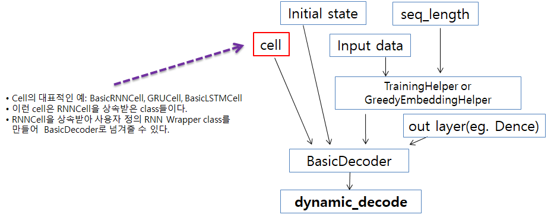
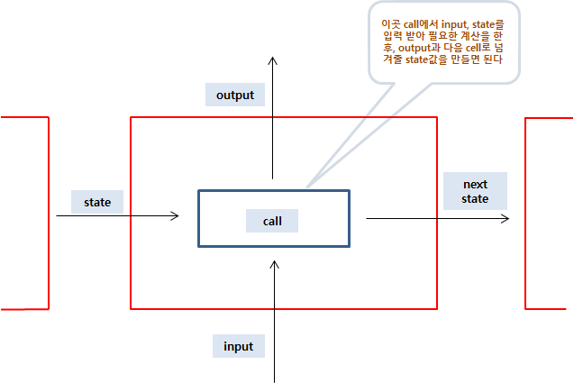

# Tensorflow에서 BasicDecoder에 넘겨 줄 수 있는 사용자 정의 RNN Wrapper Class를 만들어 보자.
###[목차]
* [쉬운 것부터 시작해보자](*쉬운-것부터-시작해보자)
* [이제 Tensorflow에 있는 BasicRNNCell을 직접 만들어보자](*이제-Tensorflow에-있는-BasicRNNCell을-직접-만들어보자)

### [쉬운 것부터 시작해보자]

아래 그림은 tf.contrib.seq2seq.BasicDecoder(class)와 tf.contrib.seq2seq.dynamic_decode(함수)의 입력 구조를 그려놓은 것이다.
BasicDecoder, dynamic_decode를 잘 모르는 경우에는 이전 post인 [RNN-Tutorial](https://github.com/hccho2/RNN-Tutorial)를 참고하면 된다.

* Tensorflow의 dynamic_decode는 BasicDecoder를 입력받고, BasicDecoder는 cell, Helper 등을 입력받아 RNN모델이 구현된다.
* 이 post에서는 user defined RNNCell 구현에 대해서 알아보고자 한다.
* 먼저, cell의 대표적인 예로는 Tensorflow에 구현되어 있는 BasicRNNCell, GRUCell, BasicLSTMCell 등이 있다.
* 이런 cell들은 (Tensorflow의) RNNCell을 상속받은 class들이다.
* RNNCell을 상속받아 사용자 정의 RNN Wrapper class를 만들어  BasicDecoder로 넘겨줄 수 있다.
* 이제, 초간단으로 만들어진 user defined RNN Wrapper의 sample code를 살펴보자.

```python
from tensorflow.contrib.rnn import RNNCell

class MyRnnWrapper(RNNCell):
    # property(output_size, state_size) 2개와 call을 정의하면 된다.
    def __init__(self,state_dim,name=None):
        super(MyRnnWrapper, self).__init__(name=name)
        self.sate_size = state_dim

    @property
    def output_size(self):
        return self.sate_size  

    @property
    def state_size(self):
        return self.sate_size  

    def call(self, inputs, state):
        # 이 call 함수를 통해 cell과 cell이 연결된다.
        cell_output = inputs
        next_state = state + 0.1
        return cell_output, next_state 
```
* 위 코드는, RNNCell을 상속받아 class MyRnnWrapper를 구현하고 있다.
* MyRnnWrapper에서 반드시 구현하여야 하는 부분은 perperty output_size와 state_size 이다. 그리고 call(self, inputs, state)이라는 특수한 class method를 구현해야 한다.
* output_size는 RNN Model에서 출력될 결과물의 dimension이고 state_size는 cell과 cell를 연결하는 hidden state의 크기이다. 
* call 함수(method)는 input과 직전 cell에서 넘겨 받은 hidden state값을 넘겨 받아, 필요한 계산을 수행한 후, 다음 단계로 넘겨 줄 next_state와 cell_output를 구하는 역할을 수행한다.


* 위 sample code은 넘겨받은 input을 그대로 output으로 내보내고, 넘겨 받은 state는 test 삼아, 0.1을 더해 next_state로 넘겨주는 의미 없는 example이다.
* 지금까지 만든 MyRnnWrapper를 dynamic_decode로 넘겨 볼 수 있는 간단한 예를 만들어 돌려보자. 아래 코드가 이해되지 않는다면 위에서 언급한 [RNN-Tutorial](https://github.com/hccho2/RNN-Tutorial)를 참고하면 된다.
* last state의 출력 값이 0.6인 이유는? 
```python
# coding: utf-8
SOS_token = 0
EOS_token = 4
vocab_size = 5
x_data = np.array([[SOS_token, 3, 3, 2, 3, 2],[SOS_token, 3, 1, 2, 3, 1],[SOS_token, 1, 3, 2, 2, 1]], dtype=np.int32)

print("data shape: ", x_data.shape)
sess = tf.InteractiveSession()

output_dim = vocab_size
batch_size = len(x_data)
seq_length = x_data.shape[1]
embedding_dim = 2

init = np.arange(vocab_size*embedding_dim).reshape(vocab_size,-1)

train_mode = True
alignment_history_flag = False
with tf.variable_scope('test') as scope:
    # Make rnn
    cell = MyRnnWrapper(embedding_dim,"xxx")

    embedding = tf.get_variable("embedding", initializer=init.astype(np.float32),dtype = tf.float32)
    inputs = tf.nn.embedding_lookup(embedding, x_data) # batch_size  x seq_length x embedding_dim

    #######################################################

    initial_state = cell.zero_state(batch_size, tf.float32) #(batch_size x hidden_dim) x layer 개수 
    
    helper = tf.contrib.seq2seq.TrainingHelper(inputs, np.array([seq_length]*batch_size))

    decoder = tf.contrib.seq2seq.BasicDecoder(cell=cell,helper=helper,initial_state=initial_state,output_layer=None)    
    outputs, last_state, last_sequence_lengths = tf.contrib.seq2seq.dynamic_decode(decoder=decoder,output_time_major=False,impute_finished=True,maximum_iterations=10)

    
    ######################################################
    sess.run(tf.global_variables_initializer())
    print("\ninputs: ",inputs)
    inputs_ = sess.run(inputs) 
    print("\n",inputs_)    
    
    print("\noutputs: ",outputs)
    outputs_ = sess.run(outputs.rnn_output) 
    print("\n",outputs_) 

    print("\nlast state: ",last_state)
    last_state_ = sess.run(last_state) 
    print("\n",last_state_) 
"""
inputs:  Tensor("test/embedding_lookup:0", shape=(3, 6, 2), dtype=float32)

 [[[0. 1.]
  [6. 7.]
  [6. 7.]
  [4. 5.]
  [6. 7.]
  [4. 5.]]

 [[0. 1.]
  [6. 7.]
  [2. 3.]
  [4. 5.]
  [6. 7.]
  [2. 3.]]

 [[0. 1.]
  [2. 3.]
  [6. 7.]
  [4. 5.]
  [4. 5.]
  [2. 3.]]]

outputs:  BasicDecoderOutput(rnn_output=<tf.Tensor 'test/decoder/transpose:0' shape=(3, ?, 2) dtype=float32>, sample_id=<tf.Tensor 'test/decoder/transpose_1:0' shape=(3, ?) dtype=int32>)

 [[[0. 1.]
  [6. 7.]
  [6. 7.]
  [4. 5.]
  [6. 7.]
  [4. 5.]]

 [[0. 1.]
  [6. 7.]
  [2. 3.]
  [4. 5.]
  [6. 7.]
  [2. 3.]]

 [[0. 1.]
  [2. 3.]
  [6. 7.]
  [4. 5.]
  [4. 5.]
  [2. 3.]]]

last state:  Tensor("test/decoder/while/Exit_3:0", shape=(3, 2), dtype=float32)

 [[0.6 0.6]
 [0.6 0.6]
 [0.6 0.6]]
"""    
```

### [이제 Tensorflow에 있는 BasicRNNCell을 직접 만들어보자]
* 이제, 조금 더 의미 있는 user defined RNN Wrapper class를 만들어 보자. Tensorflow에 이미 구현되어 있는 tf.contrib.rnn.BasicRNNCell을 직접 구현해 보자.

* BasicRNNCell은 input과 이전 state를 concat하여 kernel을 곱한 후, bias를 더하고 tanh를 취하는 구조이다.
* 이런 구조의 RNNCell을 만들기 위해서는 kernel과 bias를 정의해야 하고, call method에서 필요한 연산을 해 주면 된다.
* kernel과 bias의 정의는 build(self, inputs_shape)라는 특수한 형태의 함수에서 해주면 된다.
```python
class MyBasicRNNWrapper(RNNCell):
    # property(output_size, state_size) 2개와 call을 정의하면 된다.
    def __init__(self,state_dim,name=None):
        super(MyBasicRNNWrapper, self).__init__(name=name)
        self.sate_size = state_dim

    @property
    def output_size(self):
        return self.sate_size  

    @property
    def state_size(self):
        return self.sate_size  

    def build(self, inputs_shape):
        # 필요한 trainable variable이 있으면 여기서 생성하고, self.built = True로 설정하면 된다.
        input_depth = inputs_shape[1].value
        self._kernel = tf.get_variable('kernel', shape=[input_depth + self.sate_size, self.sate_size])
        self._bias = tf.get_variable('bias', shape=[self.sate_size],  initializer=tf.zeros_initializer(dtype=tf.float32))
    
        self.built = True  # 필요한 변수가 선언되었다는 것을 super에게 알려주는 역할.

    def call(self, inputs, state):
        # 이 call 함수를 통해 cell과 cell이 연결된다.
        gate_inputs = tf.matmul(tf.concat((inputs,state),axis=1),self._kernel)
        gate_inputs = tf.nn.bias_add(gate_inputs,self._bias)
        cell_output = tf.tanh(gate_inputs)
        next_state = cell_output
        return cell_output, next_state 

```
* 위와 같이 MyBasicRNNWrapper를 만들고 나면 MyRnnWrapper를 test했던 코드에서 Wrapper Class만 바꾸어서 test하면 된다.
```python
hidden_dim = 4
#cell = MyRnnWrapper(embedding_dim,"xxx")
cell = MyBasicRNNWrapper(hidden_dim,"xxx")
```

### [원하는 구조로 RNN Cell을 설계할 수 있다]
* 입력 값인 input이 들어오면, FC layer를 한번 거친 후, state와 결합하여 연산하는 구조를 원한다면, call method를 수정해주면 된다.
```python
def call(self, inputs, state):
	# 이 call 함수를 통해 cell과 cell이 연결된다.
	inputs = tf.layers.dense(inputs,units=self.input_depth,kernel_initializer = tf.contrib.layers.xavier_initializer(False), activation=tf.nn.relu)
	gate_inputs = tf.matmul(tf.concat((inputs,state),axis=1),self._kernel)
	gate_inputs = tf.nn.bias_add(gate_inputs,self._bias)
	cell_output = tf.tanh(gate_inputs)
	next_state = cell_output
	return cell_output, next_state 
```
* 출력값 cell_output을 FC layer를 한 번 거친 후, 내보내고 싶다면, 약간만 수정해 준다면 어렵지 않다.
* 이런 식으로 원하는 구조로 얼마든지 변형이 가능하기 때문에, 원하는 모델을 만드는 것이 가능하다.

### [p.s.]
* 지금까지 tensorflow의 seq2seq 모델에서 BasicDecoder에 넘겨 줄 수 있는 user defined RNN Wrapper을 구현해 보았다.
* RNN Wrapper를 구현하게 된 것은 Tacotron모델을 공부하는 과정에서 Bahdanau Attention을 변형하여 user defined Attention, user defined Helper 등을 공부했는데, 
* 이러한 것을 이해하기 위해서는 먼저 Wrapper Class를 잘 이해할 필요가 있기 때문에, user defined Wrapper Class 만들기를 정리해 보았다.
* 추후,
	+ user defined Helper class 만들기
	+ user defined Attention 만들기 등을 정리해 볼 예정입니다.
